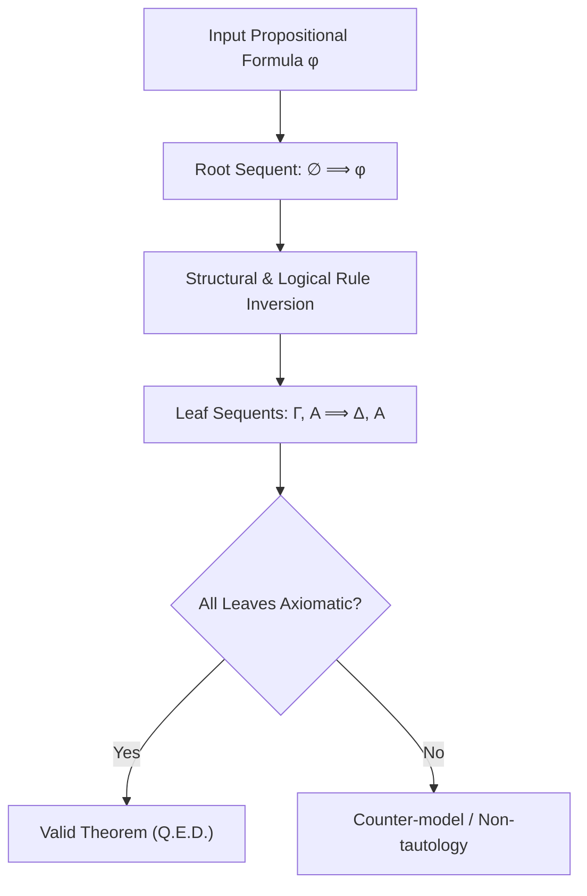

# Gentzen Sequent Calculus LK Prover Skill

Automated cut-free sequent calculus theorem prover for classical propositional logic.

## Features
- **100% Python Standard Library**: Structural proof tree decomposition.
- **Cut Elimination Guarantee**: Analytic proof search guaranteed to terminate.
- **Decidable Propositional Validity**: Exact proof of classical tautologies.
